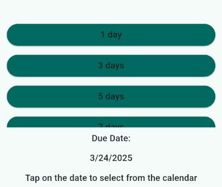

# Bullet Date Selector




A customizable Flutter widget for quickly selecting dates using a list of bullet-like quick-select buttons and an optional calendar picker.
By default, the widget displays a fixed list of slots (e.g., `[1, 3, 5, 7, 10, 14, 15, 30, 45]`) but can be fully customized with your own slot list and localized text.

## Features

- **Fixed or Custom Slot List:** Use the default `[1, 3, 5, 7, 10, 14, 15, 30, 45]` or supply your own.
- **Quick-Select Buttons:** Each slot corresponds to a date offset from today.
- **Calendar Picker Integration:** Offers a fallback or alternative way to pick a date.
- **Localization Ready:** Texts (including tooltips) adapt to supported locales (e.g., English, Turkish).
- **Theme-Adaptive:** Leverages `Theme.of(context)` for colors and text styles by default.
- **Highly Customizable:** Override colors, text styles, slot generation, and more.

## Installation

Add the following line to your `pubspec.yaml` under `dependencies`:

```yaml
dependencies:
  bullet_date_selector: ^1.0.0
```

Then run:
```bash
flutter pub get
```

## Usage

```dart
import 'package:flutter/material.dart';
import 'package:bullet_date_selector/bullet_date_selector.dart';

class MyHomePage extends StatefulWidget {
  const MyHomePage({Key? key}) : super(key: key);

  @override
  State<MyHomePage> createState() => _MyHomePageState();
}

class _MyHomePageState extends State<MyHomePage> {
  DateTime? _selectedDate;

  @override
  Widget build(BuildContext context) {
    return Scaffold(
      appBar: AppBar(
        title: const Text('Bullet Date Selector Demo'),
      ),
      body: Padding(
        padding: const EdgeInsets.all(16.0),
        child: BulletDateSelector(
          onDateSelected: (date) {
            setState(() => _selectedDate = date);
          },
        ),
      ),
      floatingActionButton: FloatingActionButton(
        onPressed: () {
          if (_selectedDate != null) {
            ScaffoldMessenger.of(context).showSnackBar(
              SnackBar(content: Text('Selected: $_selectedDate')),
            );
          }
        },
        child: const Icon(Icons.check),
      ),
    );
  }
}
```

## Customization

Below are some optional parameters you can override:

| **Parameter**     | **Description**                                                                         | **Default**                                    |
|-------------------|-----------------------------------------------------------------------------------------|------------------------------------------------|
| `customSlotList`  | Provide a custom list of slot values if you don’t want the default slots.               | `[1, 3, 5, 7, 10, 14, 15, 30, 45]`             |
| `gap`             | Vertical space between sections.                                                        | `8.0`                                          |
| `listHeight`      | The max height for the slot list.                                                       | `200.0`                                        |
| `titleText`       | Custom text for the title above the calendar picker.                                    | –                                              |
| `showTitleText`   | Whether to show the title.                                                              | `true`                                         |
| `titleTextStyle`  | Override style for the title text.                                                      | –                                              |
| `showHelperText`  | Whether to show helper text.                                                            | `true`                                         |
| `helperText`      | Override for the helper text.                                                           | –                                              |
| `helperTextStyle` | Style override for helper text.                                                         | –                                              |
| `buttonColor`     | Button background color. Defaults to the theme’s primary color if not provided.         | Theme primary color                            |
| `slotTextStyle`   | Text style for the slot buttons.                                                        | Theme’s `titleMedium`                          |
| `slotButtonStyle` | Fully customize the `ElevatedButton` style for the slot buttons.                        | –                                              |
| `dateTextStyle`   | Style for the selected date text.                                                       | Theme’s `titleMedium`                          |

## Example Project
Check out the example folder in this repo for detailed usage of the widget. 
https://github.com/OsmanTurgut2335/BulletDateSelector/blob/main/bullet_date_selector/example/lib/main.dart

## Contributing
Contributions are welcome! Feel free to open an issue or submit a pull request on GitHub.

## License
This project is licensed under the MIT License.